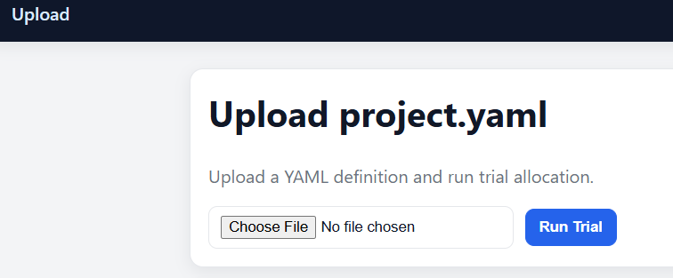
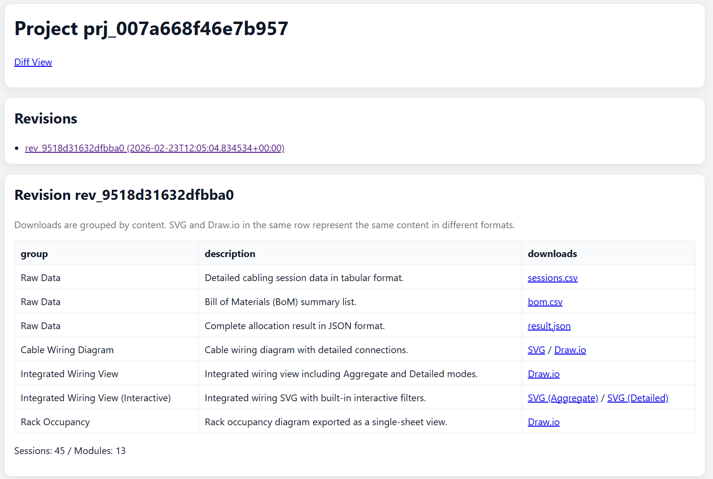
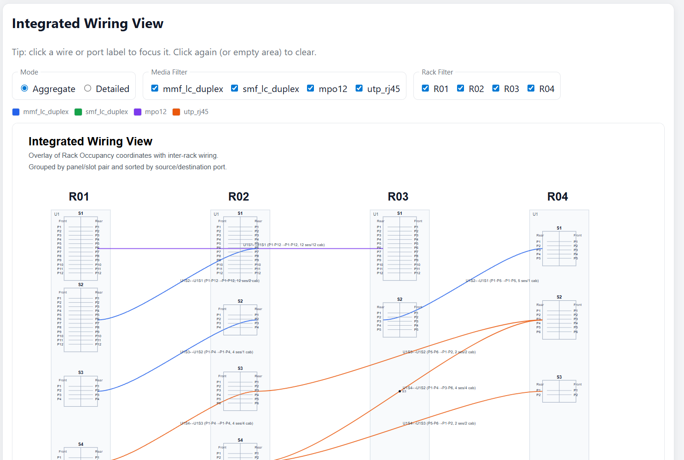
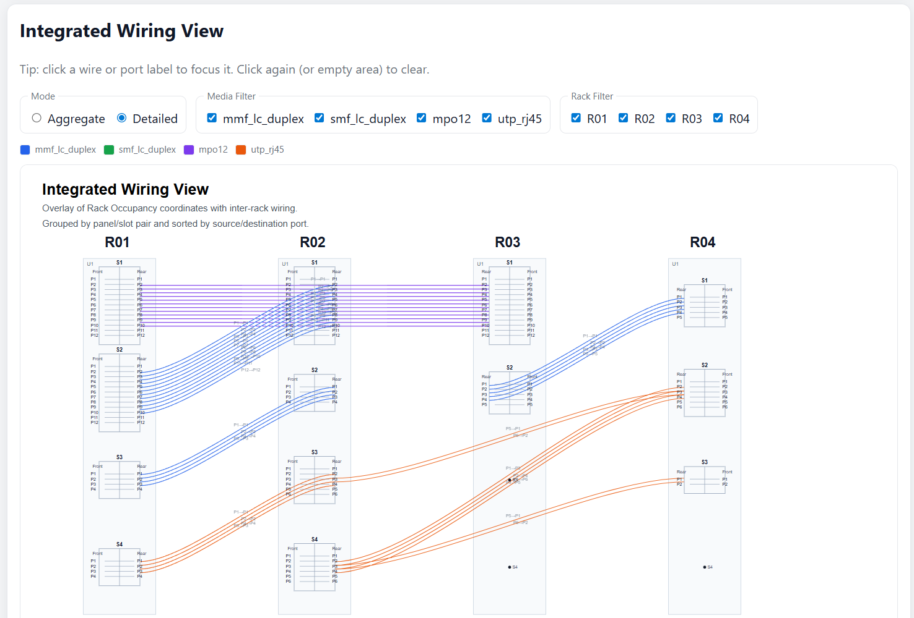

<!-- SPDX-License-Identifier: Apache-2.0 -->
<!--
This file was created or modified with the assistance of an AI (Large Language Model).
Review required for correctness, security, and licensing.
-->

# Scenario B: Mixed 4-rack project (EN)

## Purpose
Demonstrate a slightly larger topology with multiple peers and media.

## Input file
- `examples/onboarding/mixed-4rack.yaml`

## Input characteristics
- 4 racks (`R01`..`R04`)
- 5 demands across multiple rack pairs
- Three media types (`mmf_lc_duplex`, `mpo12`, `utp_rj45`)
- `peer_sort: natural_trailing_digits` for deterministic peer ordering

## Why this pattern is useful
- Shows behavior when demands are distributed across several peers
- Makes output inspection realistic without becoming too large
- Useful for checking category priority and ordering effects

## Expected output shape
### `result.json`
- `metrics.rack_count` is `4`
- `metrics.session_count` equals total demand count (`16 + 12 + 8 + 5 + 4 = 45`)
- `warnings` may be present depending on constraints, but no `errors` in a valid run

### `sessions.csv`
- Contains 45 data rows (plus header)
- `media` includes `mmf_lc_duplex`, `mpo12`, `utp_rj45`
- Rack pairs include `R01-R02`, `R01-R03`, `R02-R04`, `R03-R04`

### `bom.csv`
- Usually includes multiple module/cable description lines for mixed media
- Quantities are larger than the 2-rack scenario

### Visual artifacts
- `wiring.svg` shows a denser topology than scenario A
- Integrated wiring views are useful to switch between aggregate and detail

## How to verify quickly
1. Upload `examples/onboarding/mixed-4rack.yaml`.
2. Confirm `session_count == 45` and `rack_count == 4` in metrics.
3. Filter by media in integrated view and inspect path grouping.
4. Compare BOM complexity against the 2-rack scenario.

## Screenshots (optional)
- Upload page

- Project detail page

- Integrated Wiring (Aggregate)

- Integrated Wiring (Detailed)

## Related docs
- [Onboarding index](../README.en.md)
- [Japanese version](mixed-4rack.ja.md)
