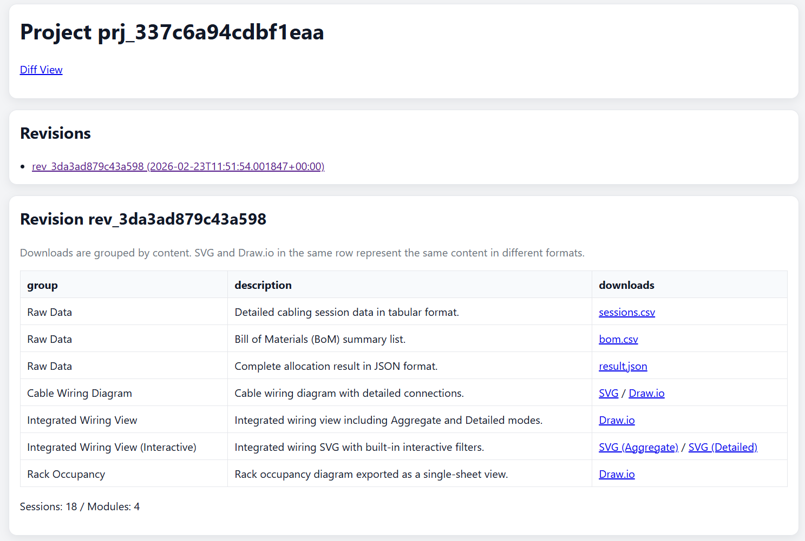
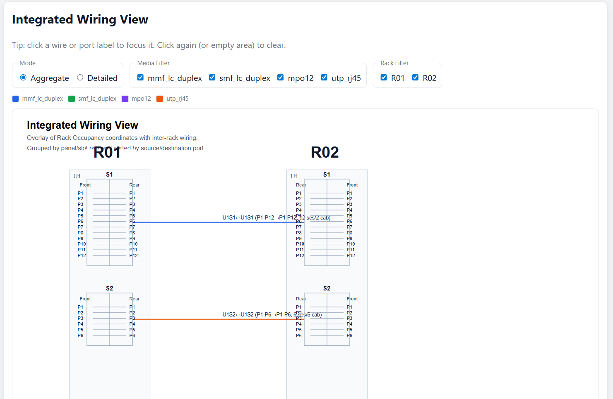
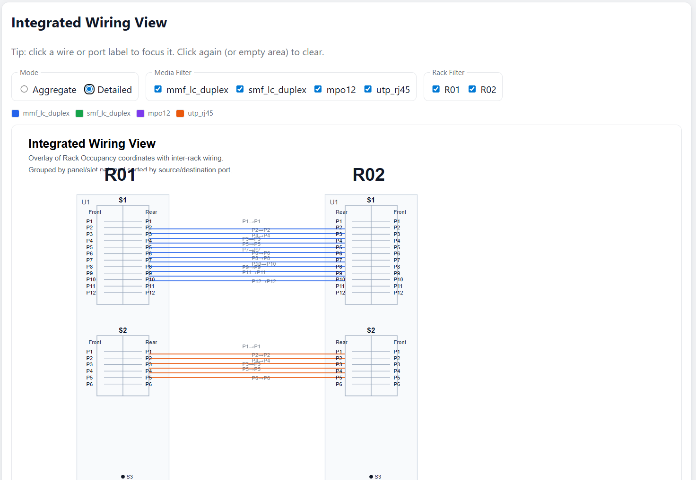

<!-- SPDX-License-Identifier: Apache-2.0 -->
<!--
This file was created or modified with the assistance of an AI (Large Language Model).
Review required for correctness, security, and licensing.
-->

# Scenario A: Simple 2-rack project (EN)

## Purpose
Use the smallest practical topology to understand input/output mapping.

## Input file
- `examples/onboarding/simple-2rack.yaml`

## Input characteristics
- 2 racks (`R01`, `R02`)
- 2 demands between one rack pair
- Mixed media in a minimal set (`mmf_lc_duplex`, `utp_rj45`)

## Why this pattern is useful
- Fast validation for first run
- Easy to inspect generated labels (`R01U...` -> `R02U...`)
- Good baseline before adding MPO or additional peers

## Expected output shape
### `result.json`
- `metrics.rack_count` is `2`
- `metrics.session_count` equals total demand count (`12 + 6 = 18`)
- `errors` should be empty for a valid run

### `sessions.csv`
- Contains 18 data rows (plus header)
- `media` appears as `mmf_lc_duplex` and `utp_rj45`
- `src_rack` and `dst_rack` are only `R01`/`R02`

### `bom.csv`
- Includes at least `panel`, `module`, and `cable` item types
- Quantity scales with demand counts and module capacity

### Visual artifacts
- `wiring.svg` shows a simple one-peer wiring relation
- Integrated view should be easy to read without heavy overlap

## How to verify quickly
1. Upload `examples/onboarding/simple-2rack.yaml`.
2. Confirm `session_count == 18` in `result.json` metrics.
3. Open `sessions.csv` and verify only one rack pair exists.
4. Check BOM has non-zero quantities for used media.

## Screenshots (optional)
- Upload page

- Project detail page

- Integrated Wiring (Aggregate)

- Integrated Wiring (Detailed)

## Related docs
- [Onboarding index](../README.en.md)
- [Japanese version](simple-2rack.ja.md)
